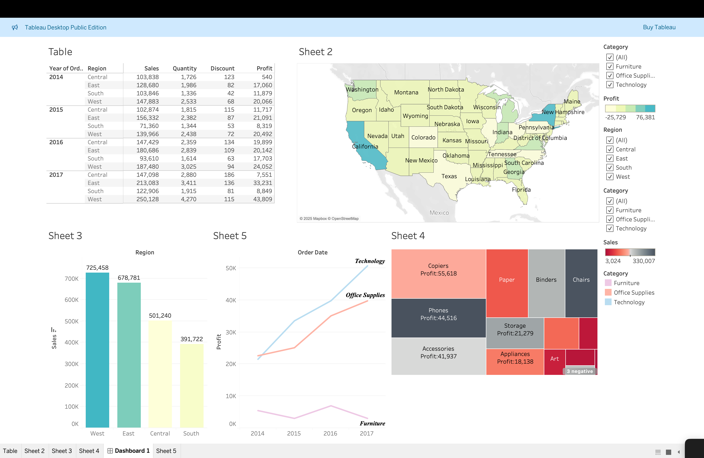

# 📊 Sales Data Analysis

A data-driven analysis of a sales dataset to uncover trends, category performance, and business insights.

---

## 🚀 Features
- Data cleaning and preprocessing
- Sales trend analysis
- Category-wise performance analysis
- Regional insights
- Data visualization using Python

---

## 🛠 Tech Stack
- Python
- pandas
- matplotlib
- seaborn
- Tableau (for dashboard)

---

## 📁 Project Files

- `analysis.py` → Python script for data analysis
- `Sales.csv` → Dataset used
- `dashboard.png` → Visualization output
- `README.md` → Project documentation

---

## 📸 Screenshots

